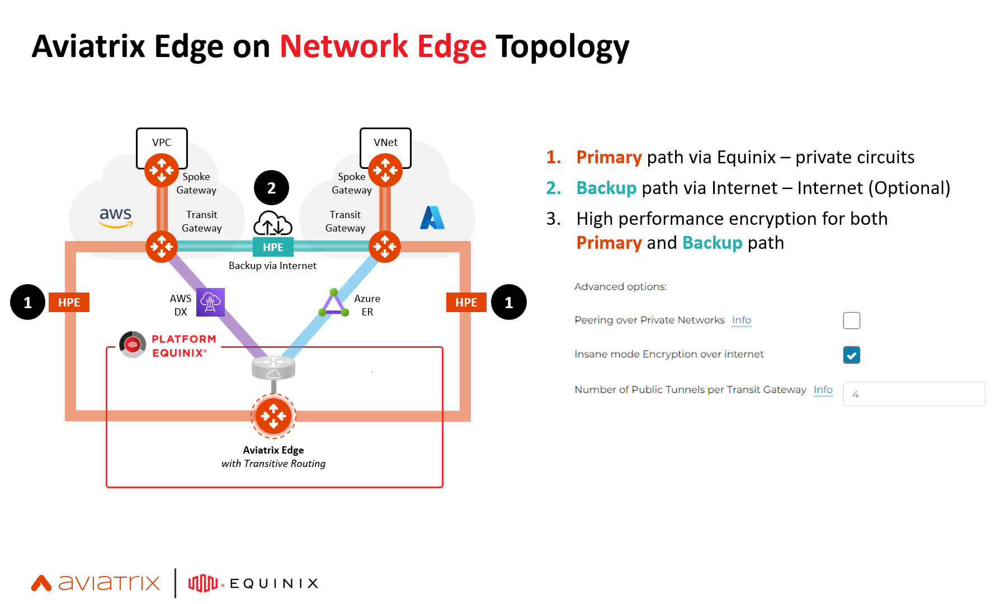

# Terraform Aviatrix Edge on Equinix Fabric

Terraform code to create the following resources which can be controlled via bool variables:
- WAN/LAN router in Equinix Fabric
- AWS Direct Connect
- Azure Express Route
- Aviatrix Edge
- Equinix Network Edge Device Links
- AWS EC2 test instance



## Prerequisites

Please make sure you have:
- Aviatrix Controller 6.9 or above
- AWS access key id and secret access key
- Azure account credentials
- Equinix API client id and secret

See file ```terraform.tfvars.examples``` for a sample of tfvars file. To run this project, you will need to set the following environment variables or provider settings.

```bash
export AWS_ACCESS_KEY_ID="<aws-access-key-id>"
export AWS_SECRET_ACCESS_KEY="<aws-access-key>"
export AWS_REGION="us-east-1"
export ARM_SUBSCRIPTION_ID="aaaa-1111-bbbb-2222-cccc-3333"
export ARM_TENANT_ID="aaaa-1111-bbbb-2222-cccc-3333"
export ARM_CLIENT_ID="aaaa-1111-bbbb-2222-cccc-3333"
export ARM_CLIENT_SECRET="A1b2C3d4E5"
export AVIATRIX_CONTROLLER_IP="<aviatrix-controller-fqdn-or-ip>"
export AVIATRIX_USERNAME="<username>"
export AVIATRIX_PASSWORD="<password>"
export EQUINIX_API_CLIENTID="<equinix-fabric-api-client-id>"
export EQUINIX_API_CLIENTSECRET="<equinix-fabric-api-client-secret>"
```

By default, SSH key and ACL for Equinix Network Edge device will not be created. Supply existing ACL Template ID in variable ```acl_template_id``` and existing SSH key name in variable ```ssh_key_name```.

To create a new ACL, supply ```acl_name``` and ```acl_description```. To create a new SSH key, supply SSH public key in ```ssh_public_key```

**Run terraform to Cisco CSR, Aviatrix Edge cloud-init ZTP, AWS DX Hosted Connection**

```bash
terraform init
terraform plan
terraform apply -auto-approve
```

Provision Aviatrix Edge Gateways from Equinix Fabric Portal and wait until provisioning is completed. Configure router. Set the following terraform variables in tfvars or environment variables to true.

```bash
export TF_VAR_update_egress_ip=true
export TF_VAR_create_device_links=true
terraform init
terraform plan
terraform apply -auto-approve
```

To configure edge attachment and BGPoLAN, set the following terraform variables in tfvars or environment variables to true.

```bash
export TF_VAR_attach_edge_aws=true
export TF_VAR_attach_edge_azure=true
export TF_VAR_create_transit_peering=true
export TF_VAR_create_edge_bgpolan=true
terraform init
terraform plan
terraform apply -auto-approve
```

## Contributing

Report issues/questions/feature requests on in the [issues](https://github.com/bayupw/terraform-aviatrix-edge-equinix-testbed/issues/new) section.

## License

Apache 2 Licensed. See [LICENSE](https://github.com/bayupw/terraform-aviatrix-edge-equinix-testbed/tree/master/LICENSE) for full details.